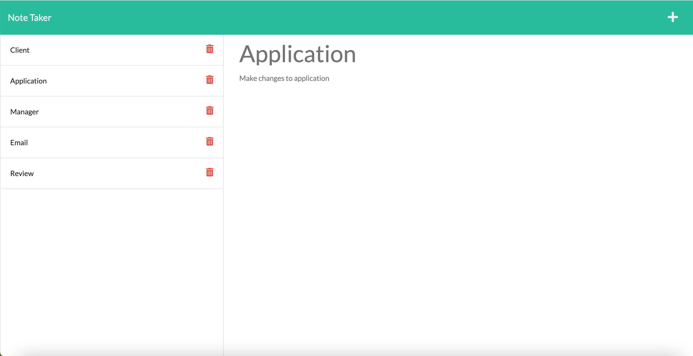

# note-taker

This is a Note Taker application, that can be used to create and save your notes to organize your plans. This application uses an Express.js back end and will save and retrieve note data from a JSON file.

## Description

* Click on the "Get Started" button on the landing page and it will take you to notes page.
* On notes pages, you are presented with a page with existing notes listed in the left-hand column, plus empty fields to enter a new note title and the note’s text in the right-hand column.
* When you enter a new note title and text then a "Save" icon appears in the navigation at the top of the page, when you click on the icon then the recently entered note will appear in the left-hand column with the other existing notes.
* When you click on an existing note in the list in the left-hand column then that note appears in the right-hand column.
* When you click on the "+" icon in the navigation at the top of the page then you are presented with empty fields to enter a new note title and the note’s text in the right-hand column.
* You will see a trash icon beside every note in the list, if you click on this icon beside any note then that note will be deleted.
* When you click on the "Note Taker" at the top left corner, it takes you back to the home page of the application.

## Features

* The features are same as explained in the description, please refer above.

## Installation

N/A

## Screenshot

## Link to the GitHub repo of the application

https://github.com/suvarna28/note-taker

## Link to the deployed application on Heroku

https://note-taker-suvarna.herokuapp.com/

## Credits

* Our TA, Sebastian for answering homework related doubts. 
* All the lessons in the Express module of the syllabus. 
